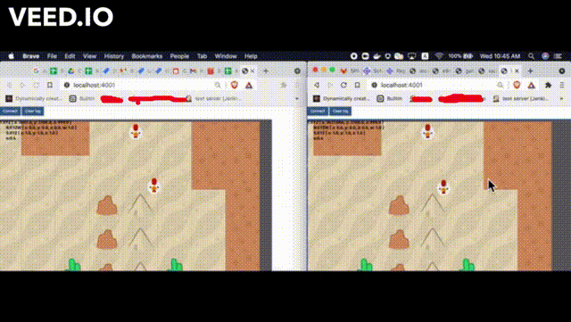

## A multiplayer browser game build with Bevy and Wasmcloud as backend
Bevy's ECS can be compiled into Wasmcloud's actor. This means that developer can still create a shared library ECS system functions between the backend and frontend

